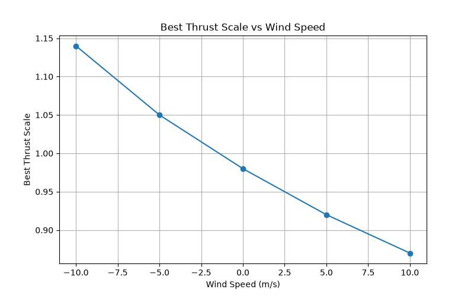

# 🚀 Rocket Flight Simulator

## Overview

This project is a physics-based rocket flight simulator developed in Python. The simulator models the vertical flight of a model rocket by incorporating realistic physical effects including thrust, changing mass, aerodynamic drag, gravity, atmospheric density variation and wind.

The simulation is validated against experimental flight data using the Root Mean Square Error (RMSE), allowing the accuracy of the model to be assessed.

---

## Project Objectives

The objective of this project was to:

- Develop a physics-based rocket flight simulator in Python.
- Predict the vertical flight trajectory of a model rocket.
- Investigate how engineering parameters influence flight performance.
- Validate simulation results against experimental flight data using RMSE.

---

## Features

- Time-varying motor thrust curve
- Variable propellant mass
- Thrust-to-weight ratio calculation
- Aerodynamic drag modelling
- Atmospheric density variation with altitude
- Wind speed effects
- Experimental validation using RMSE
- Parametric analysis using Python

---

## Software Used

- Python
- NumPy
- Pandas
- Matplotlib

---

## Governing Equations

Net Force

F = T − D − mg

Acceleration

a = F / m

Euler Integration

v = v + aΔt

h = h + vΔt

Drag

D = ½ρCdAv²

Atmospheric Density

ρ = ρ₀e^(−h/8500)

---

## Simulation Workflow

Motor Thrust Curve

        ↓
Calculate Forces

        ↓
Euler Integration

        ↓
Update Velocity

        ↓
Update Altitude

        ↓
Compare with Flight Data

        ↓
Calculate RMSE

---

## Results

### Simulation vs Experimental Flight

At baseline conditions (thrust scale = 1.0, Cd = 1.0, no wind), the simulator reaches a **maximum altitude of 146.3 m** against an experimental RMSE of **18.0 m**, tracking the real flight closely through the powered ascent and coast phase.

### Thrust Scale

Sweeping the thrust multiplier from 0.8–1.4 shows altitude increasing almost linearly with thrust, while simulation error is lowest around a thrust scale of **0.88–0.98**, where RMSE drops to about **17.9–19.4 m** — meaning the real motor performed close to, but slightly below, its nominal rated thrust.

### Drag Coefficient

The best match to experimental data occurs at **Cd ≈ 0.95–1.0**, giving the lowest RMSE (**~18.0 m**). Altitude prediction is highly sensitive to Cd, ranging from 173 m at Cd = 0.6 down to 137 m at Cd = 1.2.

### Time Step (Euler Convergence)

Reducing the time step from 0.2 s to 0.01 s converges the RMSE from **19.5 m down to 17.9 m**, showing the simulation stabilizing as numerical error shrinks. Below dt = 0.02 s, further reduction gives negligible improvement — indicating convergence.

### Thrust-to-Weight Ratio

Simulation error is minimized at a thrust-to-weight ratio of roughly **5.3–5.4**, with RMSE rising sharply on either side (up to 60+ m at the extremes). Maximum altitude increases almost linearly with TWR across the tested range.

### Propellant Mass

Maximum altitude peaks around **0.045–0.05 kg** of propellant (~150–152 m), then decreases for higher propellant loads as the added mass outweighs the extra burn time. Maximum velocity follows a similar trend, peaking near **54.6 m/s** at 0.04 kg.

### Wind Speed

The thrust scale that best matches experimental data shifts with wind — from **1.14 in a 10 m/s headwind** down to **0.87 in a 10 m/s tailwind** — showing the model correctly compensates apparent thrust for relative airspeed. Minimum achievable RMSE stays in the **17.8–19.4 m** range across all tested wind speeds.

### Summary Table

| Parameter                | Best-fit value | Minimum RMSE |
|---------------------------|----------------|--------------|
| Drag coefficient (Cd)     | ~1.0           | 18.0 m       |
| Thrust scale               | ~0.88–0.98     | 17.9–19.4 m  |
| Thrust-to-weight ratio     | ~5.3–5.4       | ~18.0 m      |
| Time step (converged)      | ≤ 0.02 s       | 17.9 m       |

---

## Engineering Investigations

This simulator was used to investigate the influence of key engineering parameters on rocket performance. Each parameter was varied independently while the remaining variables were held constant.

The investigations included:

- Thrust scale
- Drag coefficient
- Wind speed
- Propellant mass
- Thrust-to-weight ratio
- Numerical time-step (Euler convergence study)

Simulation accuracy was evaluated by comparing predicted altitude with experimental flight data using Root Mean Square Error (RMSE).

---

## Future Improvements

- Add multi-stage rocket capability
- Include launch angle effects
- Improve atmospheric modelling
- Compare with additional experimental datasets
- Replace Euler integration with RK4 for improved accuracy at larger time steps
