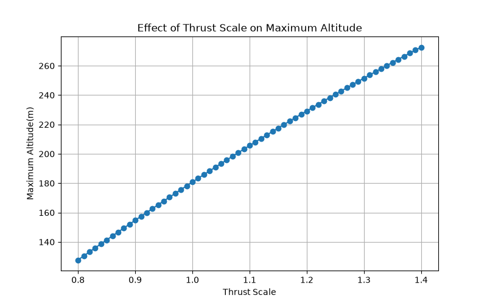
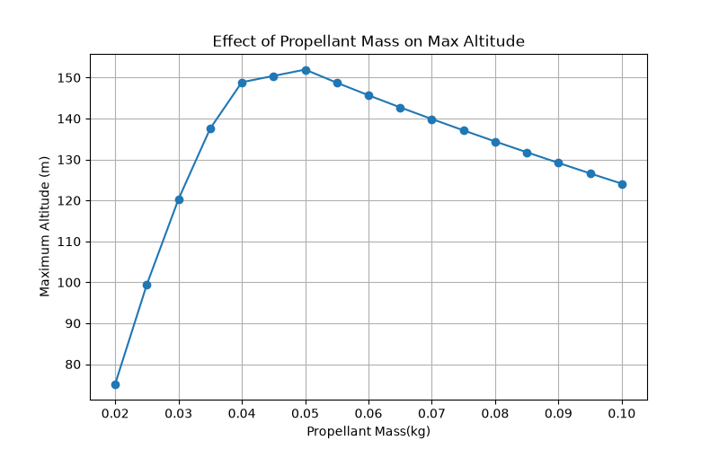

# 🚀 Rocket Flight Simulator

## Overview

This project is a physics-based rocket flight simulator developed in Python. The simulator models the vertical flight of a model rocket by incorporating realistic physical effects including thrust, changing mass, aerodynamic drag, gravity, atmospheric density variation and wind.

The simulation is validated against experimental flight data using the Root Mean Square Error (RMSE), allowing the accuracy of the model to be assessed.

---
## Project Objectives

The objective of this project was to:

- Develop a physics-based rocket flight simulator in Python.
- Predict the vertical flight trajectory of a model rocket.
- Investigate how engineering parameters influence flight performance.
- Validate simulation results against experimental flight data using RMSE.
  
---

## Features

- Time-varying motor thrust curve
- Variable propellant mass
- Thrust-to-weight ratio calculation
- Aerodynamic drag modelling
- Atmospheric density variation with altitude
- Wind speed effects
- Experimental validation using RMSE
- Parametric analysis using Python

---


## Software Used

- Python
- NumPy
- Pandas
- Matplotlib

---


## Governing Equations

Net Force

F = T − D − mg

Acceleration

a = F / m

Euler Integration

v = v + aΔt

h = h + vΔt

Drag

D = ½ρCdAv²

Atmospheric Density

ρ = ρ₀e^(−h/8500)

---


## Simulation Workflow

```text
Motor Thrust Curve
        │
        ▼
Calculate Thrust Force
        │
        ▼
Calculate Weight
        │
        ▼
Calculate Aerodynamic Drag
        │
        ▼
Compute Net Force
        │
        ▼
Calculate Acceleration
        │
        ▼
Euler Integration
        │
        ▼
Update Velocity & Altitude
        │
        ▼
Compare with Experimental Data
        │
        ▼
Calculate RMSE

```

---

## Results
The simulator was used to investigate the effects of several flight parameters on rocket performance.

The following parameters were analysed:
- Thrust Scale
- Wind Speed
- Drag Coefficient (Cd)
- Time Step
- Thrust-to-Weight Ratio
- Propellant Mass

Performance was evaluated using:
- Maximum Altitude
- Maximum Velocity
- Root Mean Square Error (RMSE) against experimental flight data

---


## 1. Simulation Validation


The simulated altitude profile closely follows the experimental flight data.
Model accuracy was quantified using the Root Mean Square Error (RMSE).

## 2. Effect of Drag Coefficient


Increasing the drag coefficient generally reduced the maximum altitude while affecting the simulation accuracy.

## 3. Effect of Thrust Scale



Increasing thrust scale increased the thrust-to-weight ratio and resulted in higher predicted apogee.

## 4. Effect of Propellant Mass



Increasing propellant mass increased burn duration but also increased launch mass, producing competing effects on altitude.

## 5. Effect of Wind Speed


The simulator investigated the influence of wind on the thrust scaling required to best match experimental flight data.

---

# Key Findings

| Investigation | Engineering Observation |
|---------------|------------------------|
| Drag coefficient | Higher drag reduced maximum altitude |
| Thrust scale | Higher thrust increased apogee |
| Propellant mass | Longer burn but lower initial thrust-to-weight ratio |
| Wind speed | Wind influenced the best-fit thrust scale |
| Time step | Smaller time steps reduced numerical error |

---

## Engineering Investigations

This simulator was used to investigate the influence of key engineering parameters on rocket performance. Each parameter was varied independently while the remaining variables were held constant.

The investigations included:

- Thrust scale
- Drag coefficient
- Wind speed
- Propellant mass
- Thrust-to-weight ratio
- Numerical time-step (Euler convergence study)

Simulation accuracy was evaluated by comparing predicted altitude with experimental flight data using Root Mean Square Error (RMSE).

---


# Model Assumptions

The current simulator assumes

- Vertical flight only
- Constant drag coefficient
- No rocket rotation
- No launch rail dynamics
- No parachute descent
  
---

## Future Improvements

- Add multi-stage rocket capability
- Include launch angle effects
- Improve atmospheric modelling
- Compare with additional experimental datasets

---

# Author

Zainab Asim

BEng Aerospace Engineering
University of Leeds

Developed as a personal engineering project to investigate rocket flight dynamics, numerical simulation and experimental validation.
